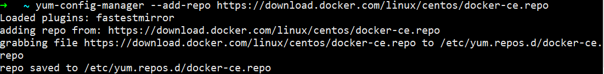
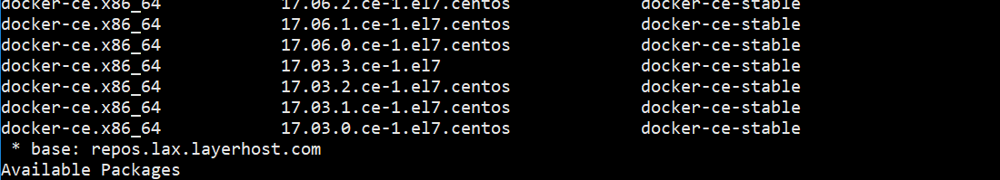
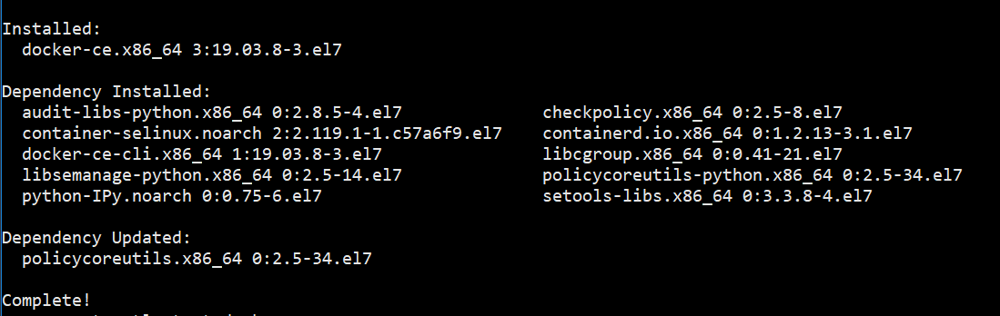

#### 首先设置yum源

```
yum-config-manager --add-repo https://download.docker.com/linux/centos/docker-ce.repo
```

<!--more-->



#### 检查是否更新成功

```
yum list docker-ce --showduplicates | sort -r
```



#### 安装docker，我这里就不指定版本了

```
yum install docker-ce -y
```



#### 运行且设置开机启动

```
systemctl start docker && systemctl enable docker
```
