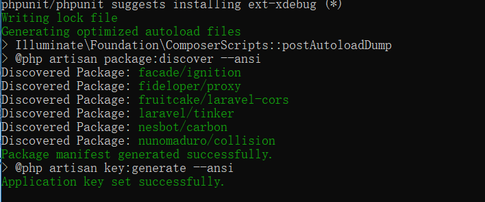

#### 首先我们使用composer命令拉取最新的laravel7项目，确保自己的环境是php >= 7.2.5

<!--more-->

```
composer create-project --prefer-dist laravel/laravel jwtdemo
```

当出现Successfully就代表完成了


#### 执行composer install 初始化laravel项目，配置.env文件，初始化数据库配置，linux系统需要注意权限问题

拉取 jwt

```
composer require tymon/jwt-auth
```

**Publish the config**

```
php artisan vendor:publish --provider="Tymon\JWTAuth\Providers\LaravelServiceProvider"
```

**Generate secret key**

```
php artisan jwt:secret
```

#### 创建表，模型，我这里将User模型移到了App\Models下

```
sql：

CREATE TABLE `users` (
  `id` int(10) unsigned NOT NULL AUTO_INCREMENT,
  `username` varchar(255) NOT NULL,
  `password` varchar(255) NOT NULL,
  `mobile` varchar(255) DEFAULT '',
  `created_at` timestamp NOT NULL,
  `updated_at` timestamp NOT NULL ON UPDATE CURRENT_TIMESTAMP,
  `deleted_at` timestamp NULL DEFAULT NULL,
  PRIMARY KEY (`id`)
) ENGINE=InnoDB AUTO_INCREMENT=5 DEFAULT CHARSET=utf8mb4;

CREATE TABLE `admins` (
  `id` int(10) unsigned NOT NULL AUTO_INCREMENT,
  `username` varchar(255) NOT NULL,
  `password` varchar(255) NOT NULL,
  `mobile` varchar(255) DEFAULT '',
  `created_at` timestamp NOT NULL,
  `updated_at` timestamp NOT NULL ON UPDATE CURRENT_TIMESTAMP,
  `deleted_at` timestamp NULL DEFAULT NULL,
  PRIMARY KEY (`id`)
) ENGINE=InnoDB AUTO_INCREMENT=5 DEFAULT CHARSET=utf8mb4;
```


#### User/Admin 实现jwt接口

```
<?php

namespace App\Models;

use Illuminate\Foundation\Auth\User as Authenticatable;
use Tymon\JWTAuth\Contracts\JWTSubject;

class Admin extends Authenticatable implements JWTSubject
{
    protected $fillable = [
        'username', 'mobile', 'password',
    ];

    /**
     * Get the identifier that will be stored in the subject claim of the JWT.
     *
     * @return mixed
     */
    public function getJWTIdentifier()
    {
        return $this->getKey();
    }

    /**
     * Return a key value array, containing any custom claims to be added to the JWT.
     *
     * @return array
     */
    public function getJWTCustomClaims()
    {
        return ['role' => 'admin'];
    }
}
```

#### 添加中间件

```
<?php

namespace App\Http\Middleware;

use Closure;
use Symfony\Component\HttpKernel\Exception\UnauthorizedHttpException;
use Tymon\JWTAuth\Exceptions\JWTException;
use Tymon\JWTAuth\Http\Middleware\BaseMiddleware;

class JWTRoleAuth extends BaseMiddleware
{
    /**
     * Handle an incoming request.
     *
     * @param $request
     * @param Closure $next
     * @param null $role
     * @return mixed
     */
    public function handle($request, Closure $next, $role = null)
    {
        try {
            // 解析token角色
            $token_role = $this->auth->parseToken()->getClaim('role');
        } catch (JWTException $e) {
            /**
             * token解析失败，说明请求中没有可用的token。
             * 为了可以全局使用（不需要token的请求也可通过）。
             * 因为这个中间件的责职只是校验token里的角色。
             */
            return response(['code'=>400,'msg'=>'缺少token']);
        }

        // 判断token角色。
        if ($token_role != $role) {
            return response(['code'=>401,'msg'=>'User role error']);
        }

        return $next($request);
    }
}
```

#### App\Http\Kernel 追加

```
// 多表jwt验证校验
'jwt.role' => \App\Http\Middleware\JWTRoleAuth::class,
```

#### Admin 验证控制器，其他的也类似

```
<?php

namespace App\Http\Controllers\Admin;

use App\Http\Controllers\Controller;
use App\Logic\AuthLogic;
use App\Models\Admin;
use Illuminate\Http\Request;
use Illuminate\Support\Facades\Hash;
use Tymon\JWTAuth\Facades\JWTAuth;

class AuthController extends Controller
{
    /**
     * 后台管理员登录
     * @param Request $request
     * @return \Illuminate\Http\JsonResponse
     */
    public function login(Request $request)
    {

        $credentials = request(['username', 'password']);

        if (! $token = auth('admin')->attempt($credentials)) {
            return response()->json(['code'=>401,'msg' => 'Unauthorized'], 401);
        }

        return $this->respondWithToken($token);
    }

    /**
     * 后台管理员注册
     * @param Request $request
     * @return \Illuminate\Http\JsonResponse
     */
    public function register(Request $request)
    {
        $username = $request->username;
        $password = $request->password;
        $user = Admin::create(['username' => $username, 'password' => Hash::make($password)]);
        return response([
            'code' => 200,
            'msg' => 'ok',
            'data' => [
                'access_token' => JWTAuth::fromUser($user),
                'token_type' => 'bearer',
            ]
        ]);
    }
    /**
     * Get the authenticated User.
     *
     * @return \Illuminate\Http\JsonResponse
     */
    public function me(Request $request)
    {
        $id = $request->user()->id;
        $username = $request->user()->username;
        $user = $request->user();
        dd($username);
        dd(auth('admin')->payload()->get());

    }
    /**
     * Refresh a token.
     *
     * @return \Illuminate\Http\JsonResponse
     */
    public function refresh()
    {
        return $this->respondWithToken(auth()->refresh());
    }
    /**
     * Get the token array structure.
     *
     * @param  string $token
     *
     * @return \Illuminate\Http\JsonResponse
     */
    protected function respondWithToken($token)
    {
        return response()->json([
            'code' => 200,
            'msg' => 'ok',
            'data' => [
                'access_token' => $token,
                'token_type' => 'bearer',
            ]
        ]);
    }
}
```

Admin + User api路由 jwt.role仅仅只验证token颁发的渠道，auth 这个中间件大家可以自行整合，比如修改验证失败的json响应体。使用auth验证 $request->user()可以拿到用户模型

jwt.auth不推荐大家使用 ，因为无法区分出来是要验证哪个表的用户

```
Route::namespace('Admin')->prefix('admin')->group(function ($admin) {
    Route::post('login', 'AuthController@login');
    Route::post('register', 'AuthController@register');
    $admin->group([
        'middleware' => ['jwt.role:admin','auth:admin'],
    ], function ($router) {
        $router->get('me', 'AuthController@me');
    });
});


Route::namespace('User')->prefix('user')->group(function ($admin) {
    Route::post('login', 'AuthController@login');
    Route::post('register', 'AuthController@register');
    $admin->group([
        'middleware' => ['jwt.role:user','auth:user'],
    ], function ($router) {
        $router->get('me', 'AuthController@me');
    });
});
```

关于Api的系统响应不是你想要的结构体时，修改App\Exceptions\Handler.php

```
public function render($request, Throwable $exception)
{
    if ($request->expectsJson()){
        return response(['code'=>400,'msg'=>$exception->getMessage()]);
    }
    return parent::render($request, $exception);
}
```

贴上我的 config\auth.php,这个配置是配合 auth中间件或auth函数使用

```
'guards' => [
       //...
       //普通用户
       'user' => [
           'driver' => 'jwt',
           'provider' => 'users',
           'hash' => false,
       ],
       //管理员
       'admin' => [
           'driver' => 'jwt',
           'provider' => 'admins',
           'hash' => false,
       ],
   'providers' => [
       'users' => [
           'driver' => 'eloquent',
           'model' => App\Models\User::class,
       ],
       'admins' => [
           'driver' => 'eloquent',
           'model' => App\Models\Admin::class,
       ],
   ],
```
