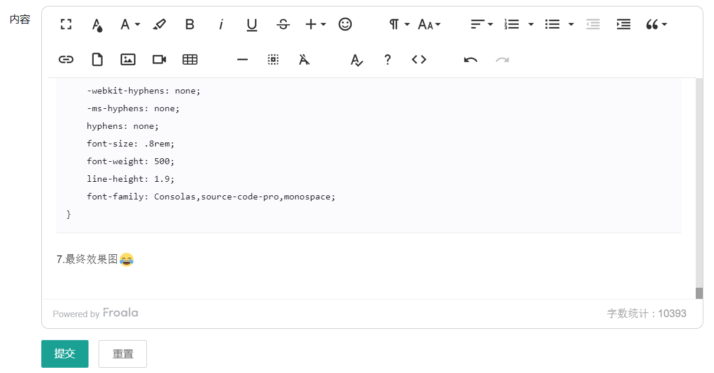

#### 首先去官网下载资源

链接：[Froala编辑器介绍网页](https://froala.com/wysiwyg-editor/)

<!--more-->


#### 将css，js引入到项目中，我这里是把所有的css，js都引入了

```
<link rel="stylesheet" href="/static/froala_editor_3.1.1/css/froala_editor.css">
<link rel="stylesheet" href="/static/froala_editor_3.1.1/css/froala_style.css">
<link rel="stylesheet" href="/static/froala_editor_3.1.1/css/plugins/code_view.css">
<link rel="stylesheet" href="/static/froala_editor_3.1.1/css/plugins/draggable.css">
<link rel="stylesheet" href="/static/froala_editor_3.1.1/css/plugins/colors.css">
<link rel="stylesheet" href="/static/froala_editor_3.1.1/css/plugins/emoticons.css">
<link rel="stylesheet" href="/static/froala_editor_3.1.1/css/plugins/image_manager.css">
<link rel="stylesheet" href="/static/froala_editor_3.1.1/css/plugins/image.css">
<link rel="stylesheet" href="/static/froala_editor_3.1.1/css/plugins/line_breaker.css">
<link rel="stylesheet" href="/static/froala_editor_3.1.1/css/plugins/table.css">
<link rel="stylesheet" href="/static/froala_editor_3.1.1/css/plugins/char_counter.css">
<link rel="stylesheet" href="/static/froala_editor_3.1.1/css/plugins/video.css">
<link rel="stylesheet" href="/static/froala_editor_3.1.1/css/plugins/fullscreen.css">
<link rel="stylesheet" href="/static/froala_editor_3.1.1/css/plugins/file.css">
<link rel="stylesheet" href="/static/froala_editor_3.1.1/css/plugins/quick_insert.css">
<link rel="stylesheet" href="/static/froala_editor_3.1.1/css/plugins/help.css">
<link rel="stylesheet" href="/static/froala_editor_3.1.1/css/third_party/spell_checker.css">
<link rel="stylesheet" href="/static/froala_editor_3.1.1/css/plugins/special_characters.css">
<script type="text/javascript" src="/static/froala_editor_3.1.1/js/froala_editor.min.js"></script>
<script type="text/javascript" src="/static/froala_editor_3.1.1/js/plugins/align.min.js"></script>
<script type="text/javascript" src="/static/froala_editor_3.1.1/js/plugins/char_counter.min.js"></script>
<script type="text/javascript" src="/static/froala_editor_3.1.1/js/plugins/code_beautifier.min.js"></script>
<script type="text/javascript" src="/static/froala_editor_3.1.1/js/plugins/code_view.min.js"></script>
<script type="text/javascript" src="/static/froala_editor_3.1.1/js/plugins/colors.min.js"></script>
<script type="text/javascript" src="/static/froala_editor_3.1.1/js/plugins/draggable.min.js"></script>
<script type="text/javascript" src="/static/froala_editor_3.1.1/js/plugins/emoticons.min.js"></script>
<script type="text/javascript" src="/static/froala_editor_3.1.1/js/plugins/entities.min.js"></script>
<script type="text/javascript" src="/static/froala_editor_3.1.1/js/plugins/file.min.js"></script>
<script type="text/javascript" src="/static/froala_editor_3.1.1/js/plugins/font_size.min.js"></script>
<script type="text/javascript" src="/static/froala_editor_3.1.1/js/plugins/font_family.min.js"></script>
<script type="text/javascript" src="/static/froala_editor_3.1.1/js/plugins/fullscreen.min.js"></script>
<script type="text/javascript" src="/static/froala_editor_3.1.1/js/plugins/image.min.js"></script>
<script type="text/javascript" src="/static/froala_editor_3.1.1/js/plugins/image_manager.min.js"></script>
<script type="text/javascript" src="/static/froala_editor_3.1.1/js/plugins/line_breaker.min.js"></script>
<script type="text/javascript" src="/static/froala_editor_3.1.1/js/plugins/inline_style.min.js"></script>
<script type="text/javascript" src="/static/froala_editor_3.1.1/js/plugins/link.min.js"></script>
<script type="text/javascript" src="/static/froala_editor_3.1.1/js/plugins/lists.min.js"></script>
<script type="text/javascript" src="/static/froala_editor_3.1.1/js/plugins/paragraph_format.min.js"></script>
<script type="text/javascript" src="/static/froala_editor_3.1.1/js/plugins/paragraph_style.min.js"></script>
<script type="text/javascript" src="/static/froala_editor_3.1.1/js/plugins/quick_insert.min.js"></script>
<script type="text/javascript" src="/static/froala_editor_3.1.1/js/plugins/quote.min.js"></script>
<script type="text/javascript" src="/static/froala_editor_3.1.1/js/plugins/table.min.js"></script>
<script type="text/javascript" src="/static/froala_editor_3.1.1/js/plugins/save.min.js"></script>
<script type="text/javascript" src="/static/froala_editor_3.1.1/js/plugins/url.min.js"></script>
<script type="text/javascript" src="/static/froala_editor_3.1.1/js/plugins/video.min.js"></script>
<script type="text/javascript" src="/static/froala_editor_3.1.1/js/plugins/help.min.js"></script>
<script type="text/javascript" src="/static/froala_editor_3.1.1/js/plugins/print.min.js"></script>
<script type="text/javascript" src="/static/froala_editor_3.1.1/js/third_party/spell_checker.min.js"></script>
<script type="text/javascript" src="/static/froala_editor_3.1.1/js/plugins/special_characters.min.js"></script>
<script type="text/javascript" src="/static/froala_editor_3.1.1/js/plugins/word_paste.min.js"></script>
<script type="text/javascript" src="/static/froala_editor_3.1.1/js/languages/zh_cn.js"></script>
```

#### 添加富文本html区域块

```
<div id="editor">
    <textarea id='edit' name="content" style="margin-top: 30px;">{{.post.Content}}</textarea>
</div>
```

#### 配置富文本功能

```
<script>
(function () {
    //这个是我自定义的按钮，用来添加代码区块的
    FroalaEditor.DefineIcon('insertCode', { NAME: 'plus', SVG_KEY: 'add' });
    FroalaEditor.RegisterCommand('insertCode', {
        title: '插入代码',
        focus: true,
        undo: true,
        type:'dropdown',
        refreshAfterCallback: true,
            options: {
              'bash': 'bash',
              'php': 'php',
              'golang': 'golang',
              'sql': 'sql',
              'html': 'html',
              'css': 'css',
              'java': 'java',
            },
        callback: function (cmd,val) {
            let txt = this.selection.text();
            if (txt === undefined) return;
            code = txt.replace(/\s+$/, ""); // rtrim
            code = $('<span/>').text(code).html(); // encode

            var htmlCode = "<pre language='" + val + "' class='code'>" + code + "</pre></div>";
            var codeBlock = "<div align='left' dir='ltr'>" + htmlCode + "</div><br/>";

            this.html.insert(codeBlock);

        }
    });
    //自定义区块--end
    new FroalaEditor("#edit",{
        key: '',
        language: 'zh_cn',
        height: 300,

        // disable quick insert
        quickInsertTags: [],

        //需要按钮可以参考这几个
        //{moreText:{buttons:
        //["bold","italic","underline","strikeThrough","subscript","superscript","fontFamily","fontSize","textColor","backgroundColor","inlineClass","inlineStyle","clearFormatting"]
        //},moreParagraph:{buttons:
        //["alignLeft","alignCenter","formatOLSimple","alignRight","alignJustify","formatOL","formatUL","paragraphFormat","paragraphStyle","lineHeight","outdent","indent","quote"]
        //},moreRich:{buttons:
        //["insertLink","insertImage","insertVideo","insertTable","emoticons","fontAwesome","specialCharacters","embedly","insertFile","insertHR"]
        //},moreMisc:{buttons:
        //["undo","redo","fullscreen","print","getPDF","spellChecker","selectAll","html","help"]
        //,align:"right",buttonsVisible:2}}

        // toolbar buttons
        toolbarButtons: ['fullscreen', 'textColor','fontFamily','backgroundColor','bold', 'italic', 'underline', 'strikeThrough','insertCode','emoticons', '|', 'paragraphFormat', 'fontSize', 'color', '|', 'align', 'formatOL', 'formatUL', 'outdent', 'indent', 'quote', '-', 'insertLink', 'insertFile', 'insertImage', 'insertVideo', 'embedly', 'insertTable', '|', 'insertHR', 'selectAll', 'clearFormatting', '|', 'spellChecker', 'help', 'html', '|', 'undo', 'redo'],

        // upload file
        imageUploadParam: 'uploadname',
        imageUploadURL: '/admin/upload',
        fileUploadMethod: 'POST',
        fileMaxSize: 20 * 1024 * 1024,
        fileAllowedTypes: ['*'],

        // upload image
        imageUploadParam: 'uploadname',
        imageUploadURL: '/admin/upload',
        imageUploadMethod: 'POST',
        imageMaxSize: 5 * 1024 * 1024,
        imageAllowedTypes: ['jpeg', 'jpg', 'png', 'gif', 'bmp', 'svg+xml'],

        // upload video
        imageUploadParam: 'uploadname',
        imageUploadURL: '/admin/upload',
        videoUploadMethod: 'POST',
        videoMaxSize: 50 * 1024 * 1024,
        videoAllowedTypes: ['avi', 'mov', 'mp4', 'm4v', 'mpeg', 'mpg', 'wmv', 'ogv'],
    })
})()
</script>
```

#### 上传图片到后端

需要注意后端返回的json url必须是 {“link”: “此次为图片地址”}

```
//上传接口
func (c *AdminController) Upload() {
   result := make(map[string]interface{})
   path := "./static/upload/" + time.Now().Format("2006/01/02")
   if _, err := os.Stat(path); os.IsNotExist(err) {
      err := os.MkdirAll(path, os.ModeDir)
      if err != nil {
         result["code"] = 2
         result["message"] = "上传异常" + err.Error()
         c.Data["json"] = result
         c.ServeJSON()
         return
      }
   }
   f, h, err := c.GetFile("uploadname")
   img := ""
   if err == nil {
      exStrArr := strings.Split(h.Filename, ".")
      exStr := strings.ToLower(exStrArr[len(exStrArr)-1])
      if exStr != "jpg" && exStr != "png" && exStr != "gif" {
         result["code"] = 1
         result["message"] = "上传只能.jpg 或者png格式"
      }
      img = path + "/" + util.UniqueId() + "." + exStr
      err := c.SaveToFile("uploadname", img) // 保存位置在 static/upload, 没有文件夹要先创建
      result["code"] = 0
      result["message"] = "上传成功"
      result["link"] = strings.TrimLeft(img, ".")
      if err != nil {
         result["code"] = 2
         result["message"] = "上传异常" + err.Error()
      }
   } else {
      result["code"] = 2
      result["message"] = "上传异常" + err.Error()
   }
   defer f.Close()
   c.Data["json"] = result
   c.ServeJSON()
}
```

#### 我用到的css

```
.code{
    display: block;
    white-space: pre;
    box-shadow: 0 1px 1px rgba(0,0,0,.075);
    padding: 1em;
    margin: .5em 0 2em;
    overflow: auto;
    -webkit-overflow-scrolling: touch;
    max-width: 100%;
    color: #090910;
    background: #fbfbfd;
    text-align: left;
    word-spacing: normal;
    word-break: normal;
    word-wrap: normal;
    -moz-tab-size: 4;
    tab-size: 4;
    -webkit-hyphens: none;
    -ms-hyphens: none;
    hyphens: none;
    font-size: .8rem;
    font-weight: 500;
    line-height: 1.9;
    font-family: Consolas,source-code-pro,monospace;
}
```

#### 最终效果图


