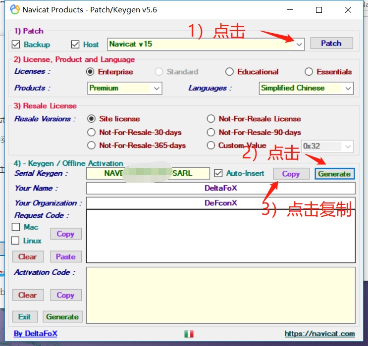
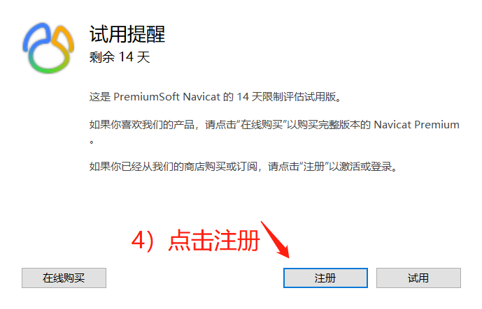
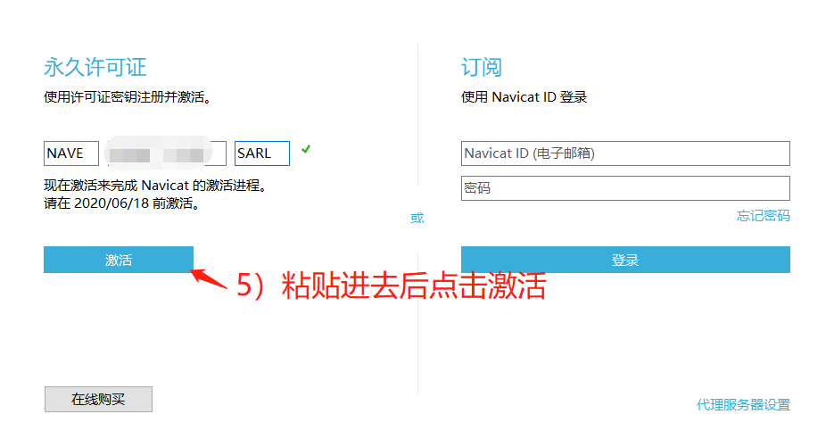
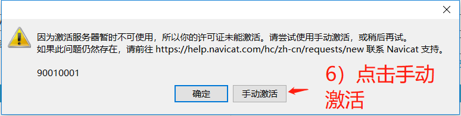
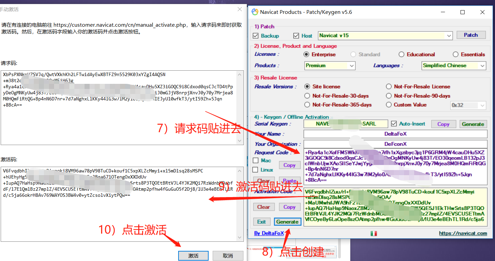
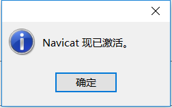
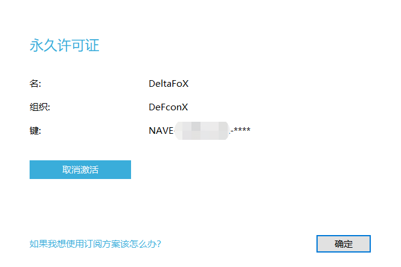

1. 大家可以去我的网盘自行下载然后安装

链接：https://share.weiyun.com/f3Fr2IGB 密码：ptbav6

2. 将kengen这个压缩包里面的文件放到 navicat15的安装目录中并打开，且将windows断网

<!--more-->

按图片上的进行操作

去注册

这一步记得将计算机断网

断网后才可以手动激活

按图片上的操作

然后提示已激活

现在可以正常的使用了
