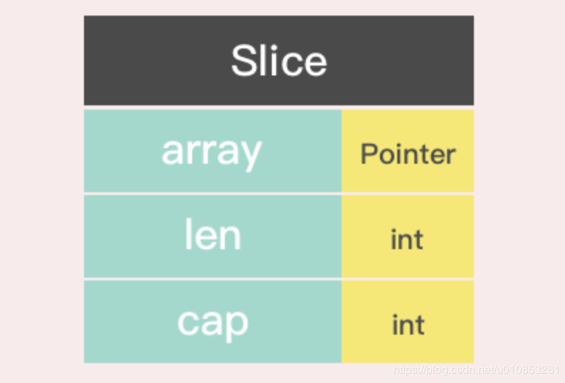
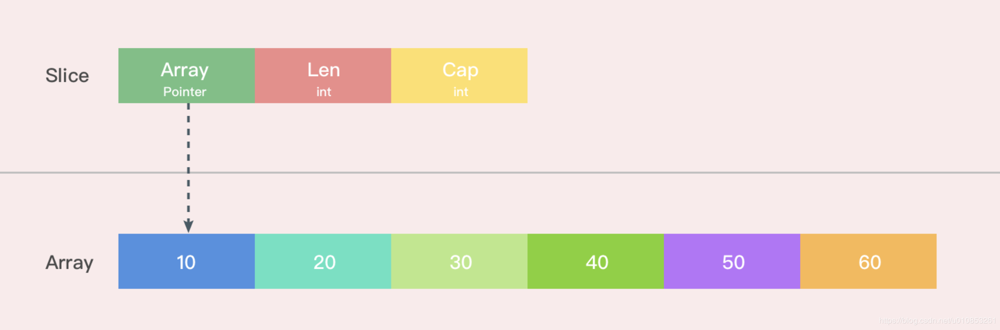
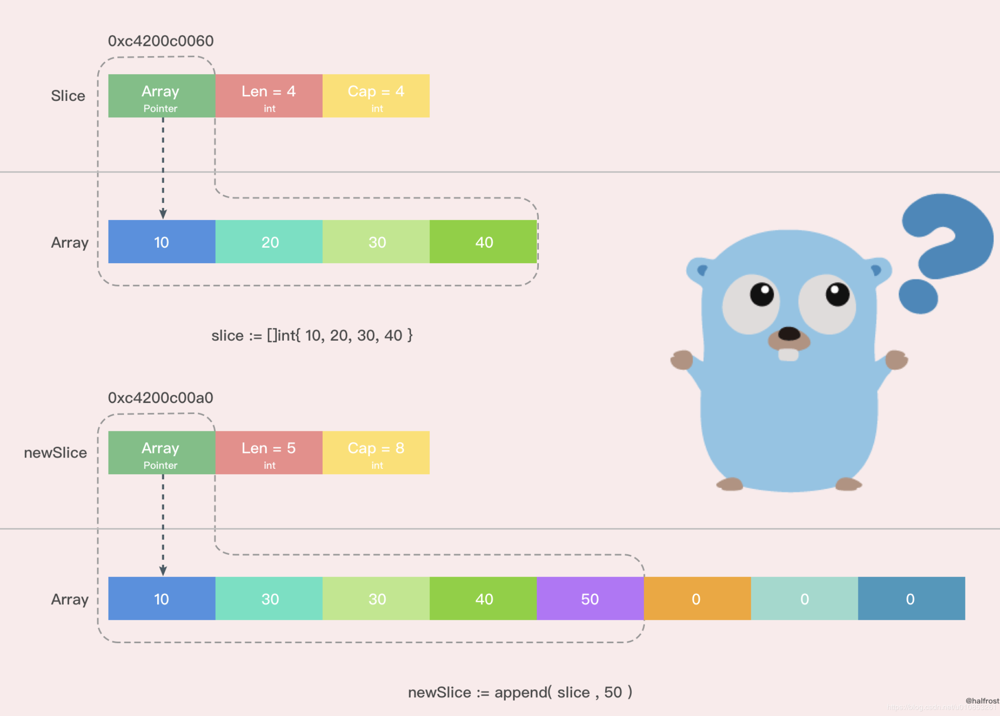

Slice变量本身指向3个东西，array，len，cap，array是一个指针，len是当前长度，cap是这个最大长度，当cap改变时会重新生成一个新的array指针

<!--more-->





当cap发生变化时，如下图所示



#### **代码：**

```
package main

import "fmt"

func main() {

   s1 := []int{1,2,3,4}
   s2 := s1 // s2 复制了 s1 的slice指针地址
   fmt.Printf("s1=%v, s1 array pointer is %p, len(s1)=%d, cap(s1)=%d\n",s1,s1,len(s1),cap(s1))
   fmt.Printf("s2=%v, s2 array pointer is %p, len(s2)=%d, cap(s2)=%d\n\n",s2,s2,len(s2),cap(s2))

   s1 = append(s1,5) // 当修改了 s1 的cap长度时，s1 会拷贝一个新的slice出来
   fmt.Printf("s1=%v, s1 array pointer is %p, len(s1)=%d, cap(s1)=%d\n",s1,s1,len(s1),cap(s1))
   fmt.Printf("s2=%v, s2 array pointer is %p, len(s2)=%d, cap(s2)=%d\n\n",s2,s2,len(s2),cap(s2))

   s2 = append(s2,6) // 当修改了 s2 的cap长度时，s2 会拷贝一个新的slice出来
   fmt.Printf("s1=%v, s1 array pointer is %p, len(s1)=%d, cap(s1)=%d\n",s1,s1,len(s1),cap(s1))
   fmt.Printf("s2=%v, s2 array pointer is %p, len(s2)=%d, cap(s2)=%d\n\n",s2,s2,len(s2),cap(s2))

   s2 = append(s2,6) // 当只是增加/减少 s2 的len长度时，cap值不变，s2 指针后面的值会修改掉
   fmt.Printf("s1=%v, s1 array pointer is %p, len(s1)=%d, cap(s1)=%d\n",s1,s1,len(s1),cap(s1))
   fmt.Printf("s2=%v, s2 array pointer is %p, len(s2)=%d, cap(s2)=%d\n\n",s2,s2,len(s2),cap(s2))

   s3 := s1[:3] // s3 只是拿了 s1 的指针，并修改了 len值，但是cap值不变 所以 s3 地址 等于 s1 地址
   fmt.Printf("s1=%v, s1 array pointer is %p, len(s1)=%d, cap(s1)=%d\n",s1,s1,len(s1),cap(s1))
   fmt.Printf("s2=%v, s2 array pointer is %p, len(s2)=%d, cap(s2)=%d\n",s2,s2,len(s2),cap(s2))
   fmt.Printf("s3=%v, s3 array pointer is %p, len(s3)=%d, cap(s3)=%d\n\n",s3,s3,len(s3),cap(s3))

   s3 = append(s3,7) // 当s3 修改了里面的值，s1 也会跟着改，但指针不变
   fmt.Printf("s1=%v, s1 array pointer is %p, len(s1)=%d, cap(s1)=%d\n",s1,s1,len(s1),cap(s1))
   fmt.Printf("s2=%v, s2 array pointer is %p, len(s2)=%d, cap(s2)=%d\n",s2,s2,len(s2),cap(s2))
   fmt.Printf("s3=%v, s3 array pointer is %p, len(s3)=%d, cap(s3)=%d\n\n",s3,s3,len(s3),cap(s3))

}
```

#### **以下是运行结果：**

```
s1=[1 2 3 4], s1 pointer is 0xc00000c360, len(s1)=4, cap(s1)=4
s2=[1 2 3 4], s2 pointer is 0xc00000c360, len(s2)=4, cap(s2)=4

s1=[1 2 3 4 5], s1 pointer is 0xc00000e2c0, len(s1)=5, cap(s1)=8
s2=[1 2 3 4], s2 pointer is 0xc00000c360, len(s2)=4, cap(s2)=4

s1=[1 2 3 4 5], s1 pointer is 0xc00000e2c0, len(s1)=5, cap(s1)=8
s2=[1 2 3 4 6], s2 pointer is 0xc00000e300, len(s2)=5, cap(s2)=8

s1=[1 2 3 4 5], s1 pointer is 0xc00000e2c0, len(s1)=5, cap(s1)=8
s2=[1 2 3 4 6 6], s2 pointer is 0xc00000e300, len(s2)=6, cap(s2)=8

s1=[1 2 3 4 5], s1 pointer is 0xc00000e2c0, len(s1)=5, cap(s1)=8
s2=[1 2 3 4 6 6], s2 pointer is 0xc00000e300, len(s2)=6, cap(s2)=8
s3=[1 2 3], s3 pointer is 0xc00000e2c0, len(s3)=3, cap(s3)=8

s1=[1 2 3 7 5], s1 pointer is 0xc00000e2c0, len(s1)=5, cap(s1)=8
s2=[1 2 3 4 6 6], s2 pointer is 0xc00000e300, len(s2)=6, cap(s2)=8
s3=[1 2 3 7], s3 pointer is 0xc00000e2c0, len(s3)=4, cap(s3)=8
```

详细版可以参考：https://blog.csdn.net/u010853261/article/details/99608199
